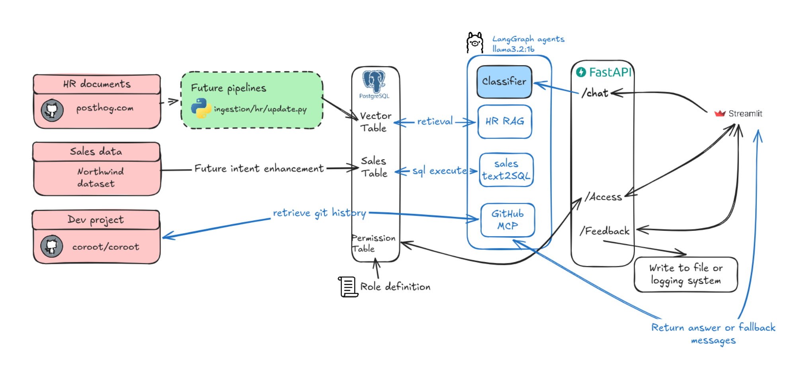

# Knowledge System

A single `/chat` fastapi endpoint orchestrating 3 agents:

1. HR handbook RAG (pgvector)
2. Sales text2SQL (Postgres)
3. Github agent (github MCP)

Along with streamlit UI for demo purpose. Everything runs on open models via Ollama; the GitHub agent needs your own read-only token (see Local Setup below).

## Project assumption

In this project I've made some assumption to simulate the enterprise setup.
1. Single DB: one Postgres instance
2. Local LLM: not using AI gateway, google/openAI api
3. HR/Sales/Github domain are separate: no question would be asked for cross-agent information (which is often not the case in the real world).
4. Small scale: demo-sized volumes (hundreds of HR doc chunks, single-digit concurrent users), not production scale.

## Architecture



### Component selection reason

1. Why pgvector? Postgres is already in the system for sales data, and it's a pragmatic docker-compose choice, not a hard technical requirement. Rejected Elasticsearch/Qdrant: both support native hybrid search (BM25 + vector), which pgvector doesn't do out of the box, but that capability isn't needed at this project's scale/complexity.
2. Why llama3.2:1b: due to the resource limitation and limited to opensource. Want to get a trade off between speed.
3. Why nomic-embed-text: lightweight, strong English embedding performance for its size, runs locally via Ollama. Rejected Qwen3-Embedding: better (and more multilingual) performance, but heavier compute cost than needed here.
4. Why FastAPI? need async for the github agent's MCP calls, plus pydantic validation and native support swagger docs.
5. Why langgraph over A2A:
  * this use case is more routing than needed agent to co-work with agent.
  * langgraph routing is deterministic code, so we can have better control for the permission.
6. Why Streamlit? fastest way to get a usable UI for a POC assuming a real frontend would be built by dedicated engineers for production.

## Data connection
| Domain | Source | Connection | Notes |
|---|---|---|---|
| Sales | [drizzle-team/drizzle-northwind-benchmarks-pg](https://github.com/drizzle-team/drizzle-northwind-benchmarks-pg) (`data/init-db.sql`) | Postgres | real classic Northwind dataset; downloaded fresh by `ingestion/sales_fetch.py` at setup time, order dates rescaled into 2026 so it reads as recent. Nothing committed to git. |
| HR handbook | [PostHog/posthog.com](https://github.com/PostHog/posthog.com), `contents/handbook/company/**` | Live GitHub crawl | PostHog's real public handbook. Crawled live by `ingestion/hr/`, nothing committed to git. |
| Dev / GitHub | [coroot/coroot](https://github.com/coroot/coroot) | GitHub MCP | real open-source observability tool, accessed read-only via MCP server. |

## Knowledge representation

Each domain keeps its own representation -- there's no shared schema or
entity graph linking them, by design (domains are disjoint, see "Why
langgraph over A2A" above).

**Limitation**: this means the system can't yet answer cross-domain
questions (Sales + Engineering + Product). Future to support that we need either a shared link layer (identifier to join information) or an orchestrator
agent orchestrate and summarize answers. (check above assumptions point 3)

| Domain | Representation | Why |
|---|---|---|
| HR handbook | Chunked text + pgvector embeddings (`hr_documents` table) | Handbook content is unstructured prose; semantic similarity search is the natural fit, so it's embedded once at ingestion time and retrieved by vector distance. |
| Sales | Normalized relational rows (Northwind schema, Postgres) | Already structured, queryable data -- text2SQL introspects the live schema at query time rather than keeping a separate model of it. |
| Dev / GitHub | Raw commit metadata, fetched live, never stored | No representation to maintain at all -- the MCP tool call returns commits straight to the LLM for summarization, so there's nothing to keep in sync. |

## Agent access / permission control

1. user permission control

To demonstrate the availability for access control, I've setup role mechanism, it comes from the `users` table (created from `postgres/init/init.sql`), looked up
via `GET /access?username=...` and enforced server-side in every `/chat` call.

| Role | Login | hr_rag | sales_sql | github |
|---|---|---|---|---|
| admin | Hsuan AD | ✅ | ✅ | ✅ |
| user | Hsuan US | ✅ | ❌ | ❌ |
| dev | Hsuan DE | ✅ | ✅ | ✅ |
| sales | Hsuan SA | ✅ | ✅ | ❌ |

2. Agent query control: app level

  * Sales agent: there's a _validate() function to enforce blocking non SELECT queries, also this agent is bound to `sales_readonly` role. Eval also caught execution-time SQL errors (bad column/alias) crashing uncaught -- now caught and returned as a graceful answer instead of a raw 500.
  * HR RAG agent: only retrieval interaction with DB
  * GitHub MCP agent: it's control by the read-only PAT


## Data pipeline maintenance

**Update pipeline**: current setup there's only HR documentation need to be updated, *assume the data is hosted in github readme*. Either we can create a job or API call add to github action once there's a changes it would trigger the job. Or we can setup a daily/weekly scheduler to check for the update.

**Clean upsert**: in HR doc, the unique document key is the url (related path on repo), I use this to identify modified documents, and delete related chunks from vector db and reindex the new and updated ones. If a changed path no longer exists in the repo (deleted upstream), its indexed chunks are removed instead of reindexed (`ingestion/hr/update.py`).

**Regular monitoring**: regular monitoring data alignment is needed, some metrics can be introduced and monitored. Or regular full indexation is also commonly seen in the field.

**Other agents**:
* for sales agents, text2SQL generally need regular revisit with business stakeholder to update the search intent but it's not implemented for this demo.
* for github MCP no data storage needed.


## Chunking strategy

1. why chunk 1024? it's a common default RAG chunking, and `llama3.2:1b` perform more stable within 4000-5000 token, retrieving `top_k=3` adding system prompt this fit well with the context.
2. Table-aware chunking: markdown tables are detected and reserved, since splitting a table across chunks is a common text-chunking failure that loses context on retrieval.
3. overlap 200 token: generally speaking a paragraph is around 150-200 token, by doing so we are less likely to lose information


## Trade-offs design:

1. Smaller-model -> open source and local laptop resource limitation.
2. Github MCP hardcode limit -> limit the max_comment and timeout second, all these approach is for demo purpose to reduce context length.
3. All queries now go through LLM-based routing -> **Future enhancement (not implemented):** a semantic route cache, embed X days / X quantity of incoming question and look up similar *past* questions in a vector store; if a close-enough match exists, reuse its route instead of calling the LLM again. This recovers most of the cost/speed.
4. Hardcode sales schema for text2sql-> work fine with small dataset, but need a more sophisticated design for this part.
5. Not implemented follow up question-> due to the time for implementation, it can be future options, which need to align the cache logic with business concept.
6. Current setup is POC-only -> `llama3.2:1b` self-hosted keeps latency/quality below production bar; for production we'd move to a larger, hosted LLM + embedding model (OpenAI/Anthropic/Google) instead of self-hosting.

## Evaluation

I've designed the evaluation with telling a more powerful LLM to generate eval cases. At least 10 per agent (positive cases and negative cases), also some irrelevant questions. In real-world cases we expect QA team or business stakeholders to provide tests, however often the case is not enough in quantity or none at all.

Therefore often we use a more powerful LLM to generate test cases, and powerful LLM as a judge, which is not in the same model family as the project model.

**⚠️ WARNING:**
Eval cannot be run locally unless you plug in a more powerful model endpoint in this file `eval/judge.py`

### Metrics chosen and why

| Metric | Scale | Applies to | Description |
|---|---|---|---|
| Routing correctness | pass/fail | Every case | Check if the router agent routed the question to the right domain (or correctly declined with "none"). |
| Correctness | 1-5 | Positive cases that reach a domain | Check if the answer actually addresses what was asked. |
| Groundedness | 1-5 | Positive cases + negative-but-routed cases | Check if the answer is backed by retrieved/queried data rather than invented. |
| Relevance | 1-5 | Positive cases that reach a domain | Check if the answer stays on topic and responds to the actual question asked. |
| Injection guarded | pass/fail | Negative-but-routed cases (prompt-injection / RBAC-edge attempts) | Check if the agent refused/ignored an injected instruction instead of complying with it. |

Now it's a common 1-5 score, but in many cases we would implement deeper in understanding the context, give a condition description for 1-5 score represent, however in here it's not implemented for a brief demo setup.

### Evaluation results

Full per-case output (every question, answer, route, and score) is committed
at `eval/results/`. Below is a summary table:

| Domain | Cases | Routing correctness | Correctness | Groundedness | Relevance |
|---|---|---|---|---|---|
| **Overall** (1) | 45 | 31% | n/a (1) | n/a (1) | n/a (1) |
| HR handbook RAG | 15 | 73% | 4.14 | 4.43 | 4.71 |
| Sales text2SQL | 15 | 7% | n/a (2) | n/a (2) | n/a (2) |
| Github agent | 5 | 40% | n/a (3) | n/a (3) | n/a (3) |
| Out of scope | 10 | 0% | n/a (2) | n/a (2) | n/a (2) |

Noted issues:

* `llama3.2:1b` defaults to `hr_rag` on ambiguous questions, tanking
  sales/out-of-scope routing. Model-level bias, not a prompt issue (tested a
  shorter `CLASSIFY_PROMPT` didn't fix it)

* (1) Overall only reflects HR -> Sales/Out-of-scope cases that now route to the wrong domain (the `hr_rag` bias above) have no real answer to grade
* (2) Wrong domain, nothing valid to score.
* (3) `github-mcp-server` only exists in Docker, not this local run (too long to run via api)

We can use this as a baseline and iterate from here. It's a small test set,
but enough to catch a real routing bug and act on it (see `How AI is used in
this project`, point 3).

Further monitoring and trouble shooting see below sections `Future trouble shooting`, `Future monitoring / altering`


## Local Setup

Copy `.env.example` to `.env` and fill in your own `GITHUB_PERSONAL_ACCESS_TOKEN`. (A fine-grained PAT with no repositories
selected and read-only access is enough);

```bash
make up            # docker compose up for all the resources
make pull-model    # pulls OLLAMA_MODEL + EMBEDDING_MODEL in ollama
make fetch-sales   # downloads + loads real Northwind data
make hr-init       # crawls PostHog handbook/company, process data to vector store
```

after it's done we can see http://localhost:8501 for streamlit app, and http://localhost:8000/docs for api swagger


## Testing Locally

to run the test locally we can do below command however it would be implement in CICD

```bash
poetry install
make test
```
----------------------------
## How AI is used in this project

My AI-SDLC for this project: Plan → Draft → Review/Challenge → Test → Document → Validate.

1. **Plan**: As a senior AI engineer, I've first come up with the project architecture in my mind. First knowing exactly what component and detail setup in my mind.
2. **Draft**: Feed the prompt with claude on my idea and my code example (private side project) to first draft a whole project.
3. **Review/Challenge**: Checking code by code if anything is missing from my past experience (like code review), challenge the method AI is providing. e.g. Claude's first draft skipped FastAPI's own recommended `Depends(get_db)` session lifecycle, using raw `SessionLocal()` calls instead, caught and adjusted by me. Another example is that AI somehow use a keyword hard coded logic to detect the route rather than relying on the LLM consistently, the eval run caught this causing real misroutes, so I had the keyword shortcut removed entirely.
4. **Test**: Asking Claude generating and iterating on the tests/ suite (RBAC, router classification edge cases, SQL-injection guardrails, GitHub agent timeout/error paths). Back and forth human testing in the loop to adjust the resources and suitable setup for the POC.
5. **Document**: Once tested and satisfy with the result I've asked AI to generate google recommended style of comment for each function; from claude generated readme adjust with my own word and my own thought / document order etc...
6. **Validate**: Finally ask AI to check if I meet all the aspect of the project


## Future trouble shooting

Once I get the feedback from the log, or a human feedback (collected by api designed /feedback located in the `api/services/feedback_service.py`), there are few steps to take.

1. Human / agent classify the feedback
2. Check which component cause issue, we can identify it from the log and reasoning.
  * router: prompt adjust, agent description adjust etc...
  * HR_rag: can the issue be fixed from the prompt or the issue is from retrieval


## Future monitoring / altering

continuous metrics:
* resource usage
* latency

periodically resample recent data to run evaluation metrics:
* correctness
* groundedness
* relevancy
* routing correctness

it can be tracked in :
* Datadog
* bigquery monitoring alerting
* ...


